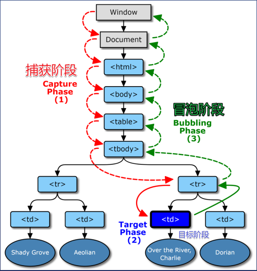

# DOM事件模型

我是从点击事件开始了解事件模型，2002年， W3C发布了一个标准：

* 文档名为DOM Level 2 Events Specification

* 规定浏览器应该同时支持两种调用顺序

* 首先按爷爷>爸爸>儿子顺序看有没有函数监听

* 然后按儿子>爸爸>爷爷顺序看有没有函数监听

* 有监听函数就调用，并提供是事件信息，没有就跳过

## 捕获：从外向内找监听函数，就叫事件捕获

## 冒泡：从内向外找监听函数，就叫事件冒泡

这里有张图片，从中可以清晰的理解捕获和冒泡的执行顺序



## addEventListener

addEventListener()的工作原理是将实现EventListener的函数或对象添加到调用它的EventTarget上的指定事件类型的事件侦听器列表中。


通俗点说就是绑定一个事件API

```javascript

//第三个参数bool默认为冒泡，如果想使用捕获，可以把boll改为true
e.addEventListener('click', fn, bool)

```

## target与currentTarget

### 区别

* e.target-用户操作的元素

* e.currentTarget-程序员监听的元素

## 【总结】

以上是我对DOM事件一点简单了解，后续学到新的知识再进行补充！！！